# Parking Lot System — UML Class Diagram

```mermaid
classDiagram

    %% ─── Enumerations ───────────────────────────────────────────
    class VehicleType {
        <<enumeration>>
        Car
        Bike
        Truck
    }

    class ParkingFeeStrategyType {
        <<enumeration>>
        Standard
        Premium
    }

    %% ─── Vehicle Hierarchy ──────────────────────────────────────
    class IVehicle {
        <<abstract>>
        +string licensePlate
        +VehicleType type
        +ParkingFeeStrategyType parkingFeeStrategyType
    }

    class Car {
        +Car(plate: string, strategyType: ParkingFeeStrategyType)
    }

    class Bike {
        +Bike(plate: string, strategyType: ParkingFeeStrategyType)
    }

    class Truck {
        +Truck(plate: string, strategyType: ParkingFeeStrategyType)
    }

    IVehicle <|-- Car
    IVehicle <|-- Bike
    IVehicle <|-- Truck

    %% ─── Parking Spot Hierarchy ─────────────────────────────────
    class IParkingSpot {
        <<abstract>>
        +int spotId
        +bool isOccupied
        +VehicleType vehicleType
    }

    class CarParkingSpot {
        +CarParkingSpot(id: int)
    }

    class BikeParkingSpot {
        +BikeParkingSpot(id: int)
    }

    class TruckParkingSpot {
        +TruckParkingSpot(id: int)
    }

    IParkingSpot <|-- CarParkingSpot
    IParkingSpot <|-- BikeParkingSpot
    IParkingSpot <|-- TruckParkingSpot

    %% ─── Ticket ─────────────────────────────────────────────────
    class Ticket {
        +string TicketId
        +IVehicle* vehicle
        +IParkingSpot* parkingSpot
        +Ticket(v: IVehicle*, spot: IParkingSpot*)
    }

    Ticket --> IVehicle : references
    Ticket --> IParkingSpot : references

    %% ─── Parking Fee Strategy ───────────────────────────────────
    class IParkingFeeStrategy {
        <<interface>>
        +calculateFee(vehicle: IVehicle, hours: int) double*
    }

    class StandardParkingFeeStrategy {
        +calculateFee(vehicle: IVehicle, hours: int) double
    }

    class PremiumParkingFeeStrategy {
        +calculateFee(vehicle: IVehicle, hours: int) double
    }

    IParkingFeeStrategy <|.. StandardParkingFeeStrategy
    IParkingFeeStrategy <|.. PremiumParkingFeeStrategy

    %% ─── Payment Strategy ───────────────────────────────────────
    class IPaymentStrategy {
        <<interface>>
        +pay(amount: double) void*
    }

    class CreditCardPayment {
        -string cardNumber
        +CreditCardPayment(card: string)
        +pay(amount: double) void
    }

    class UPIPayment {
        -string upiId
        +UPIPayment(upi: string)
        +pay(amount: double) void
    }

    class CashPayment {
        +pay(amount: double) void
    }

    IPaymentStrategy <|.. CreditCardPayment
    IPaymentStrategy <|.. UPIPayment
    IPaymentStrategy <|.. CashPayment

    %% ─── Vehicle Factory ────────────────────────────────────────
    class VehicleFactory {
        +createVehicle(type: string, licensePlate: string, strategyType: ParkingFeeStrategyType)$ IVehicle*
    }

    VehicleFactory ..> IVehicle : creates

    %% ─── Parking Lot (Singleton) ────────────────────────────────
    class ParkingLot {
        <<singleton>>
        -static ParkingLot* instance
        -vector~IParkingSpot*~ parkingSpots
        -ParkingLot()
        +createParkingLot(carSpots: int, bikeSpots: int, truckSpots: int)$ void
        +getInstance()$ ParkingLot*
        +isParkingAvailable(type: VehicleType) bool
        +parkVehicle(vehicle: IVehicle*) Ticket*
        +unparkVehicle(ticket: Ticket*, hoursParked: int, paymentStrategy: IPaymentStrategy*) bool
    }

    ParkingLot --> IParkingSpot : manages
    ParkingLot ..> Ticket : creates
    ParkingLot ..> IParkingFeeStrategy : uses
    ParkingLot ..> IPaymentStrategy : uses

    %% ─── Enum usage ─────────────────────────────────────────────
    IVehicle --> VehicleType : uses
    IVehicle --> ParkingFeeStrategyType : uses
    IParkingSpot --> VehicleType : uses
```

---

## Design Patterns Used

| Pattern | Where Applied |
|---|---|
| **Singleton** | `ParkingLot` — only one instance of the lot exists |
| **Factory Method** | `VehicleFactory::createVehicle` — centralises vehicle creation |
| **Strategy** | `IParkingFeeStrategy` (Standard / Premium) and `IPaymentStrategy` (CreditCard / UPI / Cash) |
| **Inheritance / Polymorphism** | `IVehicle`, `IParkingSpot` abstract hierarchies |

## Key Relationships

- `ParkingLot` **manages** a collection of `IParkingSpot` objects and is the central orchestrator.
- `Ticket` **links** an `IVehicle` to an `IParkingSpot` at park time.
- `ParkingLot::unparkVehicle` **selects** an `IParkingFeeStrategy` at runtime based on the vehicle's `parkingFeeStrategyType`, then delegates payment to whichever `IPaymentStrategy` is passed in.
- `VehicleFactory` decouples vehicle creation from the rest of the system.