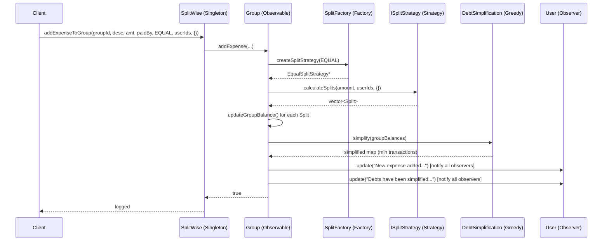

# Splitwise LLD — UML Class Diagram & Design Patterns

## Design Patterns Used

| Pattern | Where Applied | Purpose |
|---|---|---|
| **Singleton** | `SplitWise` | One global app instance manages all users, groups, and expenses |
| **Observer** | `IObserver` ← `User`; `Group` notifies members | Push notifications to all group members on expense/settlement events |
| **Strategy** | `ISplitStrategy` ← `EqualSplitStrategy`, `ExactSplitStrategy`, `PercentageSplitStrategy` | Swappable split-calculation algorithms at runtime |
| **Factory (Static)** | `SplitFactory::createSplitStrategy()` | Decouples strategy instantiation from the caller |
| **Greedy Algorithm** | `DebtSimplification::simplify()` | Minimises the total number of transactions needed to settle all debts |

---

## Class Diagram

```mermaid
classDiagram

    %% ──────────────────────────────────────────────
    %% OBSERVER PATTERN
    %% ──────────────────────────────────────────────
    class IObserver {
        <<interface>>
        +update(message: string) void
    }

    class User {
        +userId: string
        +name: string
        +email: string
        +balances: map~string, double~
        -static nextUserId: int
        +update(message: string) void
        +updateBalance(otherUserId: string, amount: double) void
        +getTotalOwed() double
        +getTotalOwing() double
    }

    IObserver <|.. User : implements

    %% ──────────────────────────────────────────────
    %% STRATEGY PATTERN
    %% ──────────────────────────────────────────────
    class ISplitStrategy {
        <<interface>>
        +calculateSplits(totalAmount: double, userIds: vector~string~, values: vector~double~) vector~Split~
    }

    class EqualSplitStrategy {
        +calculateSplits(totalAmount: double, userIds: vector~string~, values: vector~double~) vector~Split~
    }

    class ExactSplitStrategy {
        +calculateSplits(totalAmount: double, userIds: vector~string~, values: vector~double~) vector~Split~
    }

    class PercentageSplitStrategy {
        +calculateSplits(totalAmount: double, userIds: vector~string~, values: vector~double~) vector~Split~
    }

    ISplitStrategy <|.. EqualSplitStrategy : implements
    ISplitStrategy <|.. ExactSplitStrategy : implements
    ISplitStrategy <|.. PercentageSplitStrategy : implements

    %% ──────────────────────────────────────────────
    %% FACTORY PATTERN
    %% ──────────────────────────────────────────────
    class SplitFactory {
        <<factory>>
        +createSplitStrategy(type: SplitType) ISplitStrategy*$
    }

    SplitFactory ..> ISplitStrategy : creates
    SplitFactory ..> EqualSplitStrategy : «creates»
    SplitFactory ..> ExactSplitStrategy : «creates»
    SplitFactory ..> PercentageSplitStrategy : «creates»

    %% ──────────────────────────────────────────────
    %% VALUE / MODEL CLASSES
    %% ──────────────────────────────────────────────
    class Split {
        +userId: string
        +amount: double
        +Split(uid: string, a: double)
    }

    class Expense {
        +expenseId: string
        +description: string
        +amount: double
        +paidBy: string
        +splits: vector~Split~
        +groupId: string
        -static nextExpenseId: int
    }

    Expense "1" *-- "many" Split : contains

    %% ──────────────────────────────────────────────
    %% GREEDY / UTILITY
    %% ──────────────────────────────────────────────
    class DebtSimplification {
        <<utility>>
        +simplify(groupBalances: map) map$
    }

    %% ──────────────────────────────────────────────
    %% GROUP — acts as Observable
    %% ──────────────────────────────────────────────
    class Group {
        +groupId: string
        +groupName: string
        +members: vector~User*~
        +groupExpenses: map~string, Expense*~
        +groupBalances: map~string, map~string,double~~
        -static nextGroupId: int
        +addMember(user: User*) bool
        +removeMember(userId: string) bool
        +notifyMembers(message: string) void
        +addExpense(desc: string, amount: double, paidBy: string, splitType: SplitType, userIds: vector, values: vector) bool
        +settleExpense(fromUserId: string, toUserId: string, amount: double) bool
        +simplifyDebts() void
        +showGroupBalances() void
        +getUserBalance(userId: string) double
        +canUserLeaveGroup(userId: string) bool
        -getUserById(userId: string) User*
    }

    Group "1" o-- "many" User : members (observers)
    Group "1" *-- "many" Expense : groupExpenses
    Group ..> ISplitStrategy : uses via SplitFactory
    Group ..> DebtSimplification : delegates to
    Group ..> IObserver : notifies

    %% ──────────────────────────────────────────────
    %% SINGLETON — top-level façade
    %% ──────────────────────────────────────────────
    class SplitWise {
        <<singleton>>
        -users: map~string, User*~
        -groups: map~string, Group*~
        -expenses: map~string, Expense*~
        -static instance: SplitWise*
        -SplitWise()
        +getInstance() SplitWise*$
        +createUser(name: string, email: string) User*
        +getUser(userId: string) User*
        +createGroup(groupName: string) Group*
        +getGroup(groupId: string) Group*
        +addUserToGroup(userId: string, groupId: string) void
        +removeUserFromGroup(userId: string, groupId: string) bool
        +addExpenseToGroup(groupId: string, desc: string, amount: double, paidBy: string, splitType: SplitType, userIds: vector, values: vector) void
        +settleExpense(groupId: string, fromUserId: string, toUserId: string, amount: double) void
        +addIndividualExpense(...) void
        +settleIndividualExpense(fromUserId: string, toUserId: string, amount: double) void
        +showUserBalances(userId: string) void
        +showGroupBalances(groupId: string) void
        +simplifyGroupDebts(groupId: string) void
    }

    SplitWise "1" *-- "many" User : manages
    SplitWise "1" *-- "many" Group : manages
    SplitWise "1" *-- "many" Expense : manages
    SplitWise ..> Group : delegates group ops
    SplitWise ..> User : delegates user ops

    %% ──────────────────────────────────────────────
    %% ENUM
    %% ──────────────────────────────────────────────
    class SplitType {
        <<enumeration>>
        EQUAL
        EXACT
        PERCENTAGE
    }

    SplitFactory ..> SplitType : switches on
```

---

## Pattern Interaction Flow

---

## Key Design Decisions

- **Singleton `SplitWise`** is the single entry point — clients never construct `User`, `Group`, or `Expense` directly.
- **Observer** decouples `Group` from `User` notification logic; adding a new notification channel only requires a new `IObserver` implementation.
- **Strategy** makes it trivial to add new split types (e.g. share-based) without touching `Group` or `Expense`.
- **Factory** keeps the `SplitType → Strategy` mapping in one place; `Group::addExpense` stays clean.
- **`DebtSimplification::simplify`** uses a greedy two-pointer approach (largest creditor vs largest debtor) to minimise transaction count — a classic interview problem embedded directly into the system.