# Vending Machine — UML Class Diagram

## Design Pattern

This implementation uses the **State Pattern**. `VendingMachine` is the *context*; `VendingMachineState` is the *state interface*; the five concrete state classes encapsulate all behavior for each operating mode.

---

## Class Diagram

```mermaid
classDiagram
    direction TB

    class Coin {
        <<enumeration>>
        smallcoin = 1
        mediumcoin = 2
        largecoin = 5
        xlargecoin = 10
    }

    class Item {
        +string itemName
        +int itemPrice
        +Item(name string, price int)
    }

    class Inventory {
        +vector~pair~Item,int~~ items
        +Inventory()
        +addItem(item Item, qty int)
        +getItem(name string) Item
        +getQuantity(name string) int
        +getItems() vector~Item~
        +reduceQuantity(name string)
        +updateQuantity(name string, qty int)
        +isOutOfStock() bool
    }

    class VendingMachine {
        +Inventory inventory
        +int currentBalance
        +string currentItem
        +VendingMachineState state
        -VendingMachineState noCoinState
        -VendingMachineState hasCoinState
        -VendingMachineState dispensingState
        -VendingMachineState outOfStockState
        -VendingMachineState maintenanceState
        +VendingMachine()
        +~VendingMachine()
        +getBalance() int
        +updateBalance(amount int)
        +resetBalance()
        +insertCoin(coin Coin)
        +selectItem(itemName string)
        +dispenseItem()
        +restockItems(newItems vector)
        +openPanel()
        +closePanel()
        +cancelTransaction()
    }

    class VendingMachineState {
        <<interface>>
        +insertCoin(machine VendingMachine, coin Coin)*
        +selectItem(machine VendingMachine, name string)*
        +dispenseItem(machine VendingMachine)*
        +restockItems(machine VendingMachine, items vector)*
        +openPanel(machine VendingMachine)*
        +closePanel(machine VendingMachine)*
        +cancelTransaction(machine VendingMachine)*
    }

    class NoCoinState {
        +insertCoin(machine VendingMachine, coin Coin)
        +selectItem(machine VendingMachine, name string)
        +dispenseItem(machine VendingMachine)
        +restockItems(machine VendingMachine, items vector)
        +openPanel(machine VendingMachine)
        +closePanel(machine VendingMachine)
        +cancelTransaction(machine VendingMachine)
    }

    class HasCoinState {
        +insertCoin(machine VendingMachine, coin Coin)
        +selectItem(machine VendingMachine, name string)
        +dispenseItem(machine VendingMachine)
        +restockItems(machine VendingMachine, items vector)
        +openPanel(machine VendingMachine)
        +closePanel(machine VendingMachine)
        +cancelTransaction(machine VendingMachine)
    }

    class DispensingState {
        +insertCoin(machine VendingMachine, coin Coin)
        +selectItem(machine VendingMachine, name string)
        +dispenseItem(machine VendingMachine)
        +restockItems(machine VendingMachine, items vector)
        +openPanel(machine VendingMachine)
        +closePanel(machine VendingMachine)
        +cancelTransaction(machine VendingMachine)
    }

    class OutOfStockState {
        +insertCoin(machine VendingMachine, coin Coin)
        +selectItem(machine VendingMachine, name string)
        +dispenseItem(machine VendingMachine)
        +restockItems(machine VendingMachine, items vector)
        +openPanel(machine VendingMachine)
        +closePanel(machine VendingMachine)
        +cancelTransaction(machine VendingMachine)
    }

    class MaintenanceState {
        +insertCoin(machine VendingMachine, coin Coin)
        +selectItem(machine VendingMachine, name string)
        +dispenseItem(machine VendingMachine)
        +restockItems(machine VendingMachine, items vector)
        +openPanel(machine VendingMachine)
        +closePanel(machine VendingMachine)
        +cancelTransaction(machine VendingMachine)
    }

    VendingMachine *-- Inventory : has
    Inventory ..> Item : uses
    VendingMachine ..> Coin : uses
    VendingMachine --> VendingMachineState : delegates to

    NoCoinState ..|> VendingMachineState : implements
    HasCoinState ..|> VendingMachineState : implements
    DispensingState ..|> VendingMachineState : implements
    OutOfStockState ..|> VendingMachineState : implements
    MaintenanceState ..|> VendingMachineState : implements
```

---

## Classes & Relationships

### `«enumeration» Coin`

| Value | Integer |
|---|---|
| `smallcoin` | 1 |
| `mediumcoin` | 2 |
| `largecoin` | 5 |
| `xlargecoin` | 10 |

---

### `Item`

**Attributes**

| Visibility | Name | Type |
|---|---|---|
| `+` | `itemName` | `string` |
| `+` | `itemPrice` | `int` |

**Methods**

| Visibility | Signature |
|---|---|
| `+` | `Item(name: string, price: int)` |

---

### `Inventory`

**Attributes**

| Visibility | Name | Type |
|---|---|---|
| `+` | `items` | `vector<pair<Item, int>>` |

**Methods**

| Visibility | Signature | Description |
|---|---|---|
| `+` | `Inventory()` | Constructor |
| `+` | `addItem(item: Item, qty: int)` | Appends new item |
| `+` | `getItem(name: string) : Item` | Returns item or `"Not Found"` sentinel |
| `+` | `getQuantity(name: string) : int` | Returns stock count |
| `+` | `getItems() : vector<Item>` | Returns all items |
| `+` | `reduceQuantity(name: string)` | Decrements stock by 1 |
| `+` | `updateQuantity(name: string, qty: int)` | Sets absolute stock |
| `+` | `isOutOfStock() : bool` | True if all quantities are 0 |

---

### `VendingMachine` *(Context)*

**Attributes**

| Visibility | Name | Type | Note |
|---|---|---|---|
| `+` | `inventory` | `Inventory` | Composed |
| `+` | `currentBalance` | `int` | Coins inserted so far |
| `+` | `currentItem` | `string` | Selected item name |
| `+` | `state` | `VendingMachineState*` | Active state (pointer) |
| `-` | `noCoinState` | `VendingMachineState*` | Owned state instance |
| `-` | `hasCoinState` | `VendingMachineState*` | Owned state instance |
| `-` | `dispensingState` | `VendingMachineState*` | Owned state instance |
| `-` | `outOfStockState` | `VendingMachineState*` | Owned state instance |
| `-` | `maintenanceState` | `VendingMachineState*` | Owned state instance |

**Methods**

| Visibility | Signature |
|---|---|
| `+` | `VendingMachine()` |
| `+` | `~VendingMachine()` |
| `+` | `getBalance() : int` |
| `+` | `updateBalance(amount: int)` |
| `+` | `resetBalance()` |
| `+` | `insertCoin(coin: Coin)` |
| `+` | `selectItem(itemName: string)` |
| `+` | `dispenseItem()` |
| `+` | `restockItems(newItems: vector<pair<Item,int>>)` |
| `+` | `openPanel()` |
| `+` | `closePanel()` |
| `+` | `cancelTransaction()` |

---

### `«interface» VendingMachineState`

Pure virtual interface — all methods are `= 0`.

| Signature |
|---|
| `insertCoin(machine: VendingMachine*, coin: Coin) = 0` |
| `selectItem(machine: VendingMachine*, name: string) = 0` |
| `dispenseItem(machine: VendingMachine*) = 0` |
| `restockItems(machine: VendingMachine*, items) = 0` |
| `openPanel(machine: VendingMachine*) = 0` |
| `closePanel(machine: VendingMachine*) = 0` |
| `cancelTransaction(machine: VendingMachine*) = 0` |
| `virtual ~VendingMachineState() = default` |

---

### Concrete State Classes

All five classes implement `VendingMachineState` (realization). Each overrides every method with state-specific behavior.

| Class | Role | Key behavior |
|---|---|---|
| `NoCoinState` | Idle, no coins inserted | `insertCoin` → transitions to `HasCoinState` |
| `HasCoinState` | Coin(s) present | `selectItem` → validates price/stock, transitions to `DispensingState` |
| `DispensingState` | Item being vended | `dispenseItem` → reduces stock, returns change, transitions to `NoCoinState` or `OutOfStockState` |
| `OutOfStockState` | All items depleted | Only `openPanel` is actionable (→ `MaintenanceState`) |
| `MaintenanceState` | Service panel open | `restockItems` adds/updates stock; `closePanel` → `NoCoinState` or `OutOfStockState` |

---

## Relationships Summary

| From | To | Type | Multiplicity | Label |
|---|---|---|---|---|
| `VendingMachine` | `Inventory` | Composition | 1 — 1 | has |
| `Inventory` | `Item` | Dependency | 1 — * | uses |
| `VendingMachine` | `Coin` | Dependency | — | «uses» |
| `VendingMachine` | `VendingMachineState` | Association | 1 — 1 | delegates to |
| `NoCoinState` | `VendingMachineState` | Realization | — | implements |
| `HasCoinState` | `VendingMachineState` | Realization | — | implements |
| `DispensingState` | `VendingMachineState` | Realization | — | implements |
| `OutOfStockState` | `VendingMachineState` | Realization | — | implements |
| `MaintenanceState` | `VendingMachineState` | Realization | — | implements |

---

## State Transition Table

| From state | Event | To state | Condition |
|---|---|---|---|
| `NoCoinState` | `insertCoin` | `HasCoinState` | Always |
| `HasCoinState` | `insertCoin` | `HasCoinState` | Accumulates balance |
| `HasCoinState` | `selectItem` | `DispensingState` | Item found, in stock, balance ≥ price |
| `HasCoinState` | `cancelTransaction` | `NoCoinState` | Refunds balance |
| `DispensingState` | `dispenseItem` | `NoCoinState` | Stock remains after dispense |
| `DispensingState` | `dispenseItem` | `OutOfStockState` | No stock left after dispense |
| `NoCoinState` | `openPanel` | `MaintenanceState` | Always |
| `OutOfStockState` | `openPanel` | `MaintenanceState` | Always |
| `MaintenanceState` | `closePanel` | `NoCoinState` | Inventory not empty |
| `MaintenanceState` | `closePanel` | `OutOfStockState` | Inventory still empty |

---

## Notes

- The **State Pattern** allows new states to be added without modifying `VendingMachine` or existing states.
- `VendingMachine` owns all five state objects (allocated in constructor, freed in destructor) — a common State Pattern idiom.
- The machine initializes to `OutOfStockState` if inventory is empty at startup, otherwise `NoCoinState`.
- `restockItems` merges quantities for existing items and adds new ones — only callable in `MaintenanceState`.